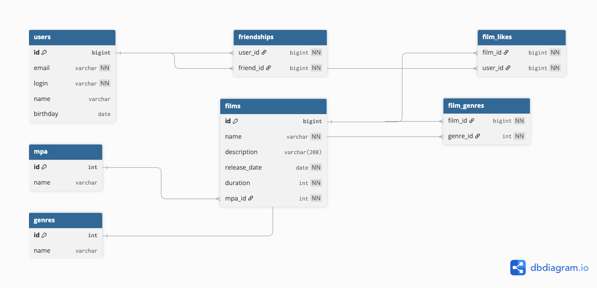

# 🎬 Filmorate

Filmorate — социальное приложение для оценки фильмов, добавления друзей и просмотра популярных лент. Поддерживает REST API и сохраняет данные в памяти (InMemory), включая работу с рейтингами MPA и жанрами.

---

## 🧩 Схема базы данных



Диаграмма отражает следующие сущности и связи:

- `users` — пользователи
- `films` — фильмы
- `mpa` — рейтинг фильма (например, G, PG-13)
- `genres` — жанры фильмов
- `film_genres` — связь "многие ко многим" между фильмами и жанрами
- `film_likes` — лайки пользователей к фильмам
- `friendships` — связи дружбы между пользователями

---

## Примеры HTTP-запросов

## 📌 Примеры HTTP-запросов

### 🎬 Работа с фильмами

**➕ Добавить фильм**

```
POST /films
Content-Type: application/json

{
  "name": "Inception",
  "description": "A dream within a dream",
  "releaseDate": "2010-07-16",
  "duration": 148,
  "mpa": { "id": 3 },
  "genres": [
    { "id": 1 },
    { "id": 2 }
  ]
}
```

**🔁 Обновить фильм**

```
PUT /films
Content-Type: application/json

{
  "id": 1,
  "name": "Inception Updated",
  "description": "Updated description",
  "releaseDate": "2010-07-16",
  "duration": 150,
  "mpa": { "id": 4 },
  "genres": [
    { "id": 2 }
  ]
}
```

**📥 Получить все фильмы**

```
GET /films
```

**🔍 Получить фильм по ID**

```
GET /films/1
```

**👍 Поставить лайк фильму**

```
PUT /films/1/like/2
```

**👎 Удалить лайк у фильма**

```
DELETE /films/1/like/2
```

**🔝 Получить популярные фильмы**

```
GET /films/popular?count=5
```

---

### 👥 Работа с пользователями

**➕ Добавить пользователя**

```
POST /users
Content-Type: application/json

{
  "email": "user@mail.com",
  "login": "username",
  "name": "User Name",
  "birthday": "2000-01-01"
}
```

**🔁 Обновить пользователя**

```
PUT /users
Content-Type: application/json

{
  "id": 1,
  "email": "new@mail.com",
  "login": "newlogin",
  "name": "New Name",
  "birthday": "1999-05-10"
}
```

**📥 Получить всех пользователей**

```
GET /users
```

**🔍 Получить пользователя по ID**

```
GET /users/1
```

**🤝 Добавить в друзья**

```
PUT /users/1/friends/2
```

**➖ Удалить из друзей**

```
DELETE /users/1/friends/2
```

**📋 Получить список друзей пользователя**

```
GET /users/1/friends
```

**👥 Получить общих друзей с другим пользователем**

```
GET /users/1/friends/common/2
```

---

### 🏷️ Работа со справочниками

**🎞️ Получить все рейтинги MPA**

```
GET /mpa
```

**🔍 Получить рейтинг MPA по ID**

```
GET /mpa/3
```

**🎭 Получить все жанры**

```
GET /genres
```

**🔍 Получить жанр по ID**

```
GET /genres/1
```
## Технологии

- **Java 17**
- **Spring Boot 3**
- **Spring Validation (Jakarta)**
- **REST API (JSON)**
- **Logbook** — логирование HTTP-запросов
- **JUnit 5 + MockMvc** — модульные и интеграционные тесты
- **Maven** — управление зависимостями и сборкой проекта

---

## Схема БД

📁 Файл схемы: `filmorate-database-schema.png`  
📌 Схема отображается прямо в этом README выше (если используете GitHub).
